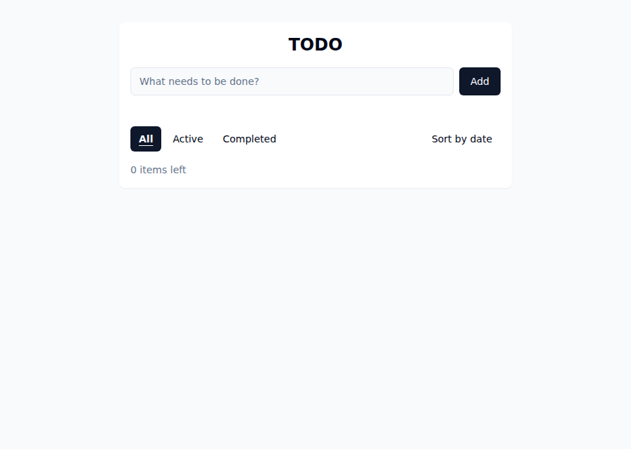

# TODO — a React app

A small TODO app built with React + Vite. Add, toggle, edit, delete, and clear completed
items — with a 5-second **Undo** after a delete or clear-completed; set an optional
**due date** per item from edit mode, see a relative **time-left label** ("in 3 days,"
"5 days ago") and a highlighted row on past-due active items, and toggle a soonest-first
**sort by date**; filter by **All / Active / Completed**; see how many remain. State
persists across reloads via a whole-list read/write API backed by SQLite (no accounts or
multi-user — a single shared list per environment). The UI logic core stays pure and
browser-testable.

**📖 User documentation lives in the [user guide](docs/guide/README.md)** (`docs/guide/`)
— one page per task area, kept current by the same pipeline that ships the code. This
README is the *developer* landing page: architecture, tests, deployment.

The same HTTP contract runs on **two runtimes** from one shared handler
(`server/handler.js`): a **local Bun server** (`server/index.js`, `bun:sqlite`) for dev, and
a **Cloudflare Worker** (`worker/index.js`, Cloudflare D1) for the deployed cloud app. See
[Cloud deployment](#cloud-deployment-cloudflare) and the one-page
[architecture map](docs/architecture.md).

## What it looks like

| First run | A working list | At the 10-item cap |
|---|---|---|
|  |  |  |

More screens — including the post-delete **Undo** affordance — are in the
[user guide](docs/guide/README.md).

These images are generated (`node scripts/screenshots.mjs --update` from
[`docs/screenshots/scenes.json`](docs/screenshots/scenes.json)) and double as the
**visual-regression baselines** CI compares every change against — so if the app drifts
from these pictures, a check notices; the docs can't silently go stale.

## Run it

```bash
bun install
bun run dev        # dev server at http://localhost:5173 (Bun API + Vite proxy)
bun run build      # production build to dist/
bun run preview    # serve the production build
bun run test       # default Vitest lane (core + component + ISSUE-19 integration)
bun run test:cloud # cloud lane: Worker/D1 contract via `wrangler dev` (local D1)
bun run dev:worker # OPTIONAL: run the Worker/D1 runtime locally on `wrangler dev`
```

Requires Bun 1.x (the package manager, task runner, and — via Vitest — test runner). Local
development does **not** require a Cloudflare account; only deploys/remote ops need a token.

## Architecture

The logic is deliberately split from the UI so it can be tested without a browser:

| File | Role |
|------|------|
| `src/todos.js` | Pure, dependency-free logic core — `addTodo`, `toggleTodo`, `editTodo`, `deleteTodo`, `clearCompleted`, `restoreTodos`, `filterTodos`, `remainingCount`, the due-date ops `isValidDueDate`, `setDueDate`, `isOverdue`, `sortByDueDate`, `dueDateLabel`, plus the load/persist helpers `sanitizeTodos`, `parseStored`, `safeSave`, `makeId`. No DOM, no React. |
| `src/storage.js` | Async persistence adapter — `fetch`es the whole list to/from the local `/api/todos` endpoint; never rejects (maps every failure to a safe fallback). |
| `src/App.jsx` | Thin React UI. Todo text is rendered via React's text escaping only (no `dangerouslySetInnerHTML`, no user text in URL/style sinks). |
| `src/main.jsx`, `index.html` | Vite entry. |
| `server/handler.js` | **Runtime-agnostic** request handler — routing, the same-origin/loopback write guard, the streaming 1 MB body cap, JSON parse, shape validation, the duplicate-id pre-check, the `MAX_LIST_LEN` bound, and the transactional whole-list replace (through an injected storage port). No `bun:sqlite`/`Bun`/D1 import. Backs BOTH runtimes, so they cannot drift. |
| `server/index.js` | Loopback-only **Bun adapter**: a `bun:sqlite` storage port + static `dist/` serving, delegating the HTTP contract to `server/handler.js`. |
| `worker/index.js` | Cloudflare **Worker adapter**: a D1 storage port (`env.DB.batch([...])`) + Static Assets fallback, delegating to the same `server/handler.js`. |
| `tests/todos.test.js` | Vitest suite exercising the pure core. |
| `tests/cloud/**` | Cloud-runtime contract tests driving `worker/index.js` over `wrangler dev` (local D1). |

The spec and implementation plan are in [docs/specs/TODO-1.md](docs/specs/TODO-1.md) and
[docs/specs/TODO-1-plan.md](docs/specs/TODO-1-plan.md); the cloud migration is specified in
[docs/specs/ISSUE-31-spec.md](docs/specs/ISSUE-31-spec.md).

## Cloud deployment (Cloudflare)

The deployed app runs on **Cloudflare Workers** (with the Static Assets binding serving the
SPA) backed by **Cloudflare D1** (serverless SQLite), one Worker + one D1 per environment,
provisioned reproducibly from committed configuration.

- **Infrastructure as code.** `wrangler.jsonc` declares the Worker, the Static Assets
  binding, and the Production D1 binding; `migrations/0001_init.sql` is the schema. Together
  they recreate an environment from scratch (`wrangler deploy` + `wrangler d1 migrations
  apply`). No console clicks. The committed file carries only a `${PRODUCTION_D1_ID}`
  placeholder (see Secret + token scopes below) — CI renders the real config at deploy time.
- **Two environments.** A stable **Production** deployment (`https://todo-app.<subdomain>.workers.dev`)
  and an **ephemeral per-PR Preview** with its own isolated, empty D1. Each preview is
  deployed from a generated `wrangler.preview.jsonc` (rendered from
  `wrangler.preview.template.jsonc` with the PR's own D1 uuid) — never the production config —
  with a fail-closed guard so a preview can never bind to the production database.
- **Migrations: `--remote` in CI, `--local` in dev.** Wrangler defaults every `d1` subcommand
  to `--local`. Every **CI/deploy** migration MUST pass `--remote` explicitly (or it migrates
  an ephemeral local file and leaves the real D1 unmigrated); local dev (`wrangler dev`,
  `dev:worker`) is correctly `--local` and MUST NOT use `--remote`.
- **Secret + token scopes.** Deploys consume a GitHub Actions secret
  `CLOUDFLARE_API_TOKEN` (plus `CLOUDFLARE_ACCOUNT_ID`) — never committed to the repo. The
  token is least-privilege: **Workers Scripts: Edit** (bundles Workers Assets upload), **D1:
  Edit**, **Account Settings: Read** (to resolve the `workers.dev` subdomain). No Zone/DNS
  scope (no custom domain). The production database's id is likewise kept out of the repo,
  but as a repository **variable** (`PRODUCTION_D1_ID`), not a secret — a D1 `database_id` is
  an opaque identifier, not a credential.

- **Deploy automation.** `.github/workflows/deploy-production.yml` migrates (`--remote`) and
  deploys on every push to `main`; `.github/workflows/deploy-preview.yml` provisions an
  isolated preview per pull request; `.github/workflows/preview-teardown.yml` tears one down
  when its PR closes; `.github/workflows/preview-gc.yml` is a scheduled sweep that reclaims
  any preview a cancelled/failed teardown missed (fail-closed: it only deletes a preview whose
  PR is confirmed `closed`, never on an API error or ambiguous state). The Worker/D1 contract
  itself is proven by the required `.github/workflows/cloud-contract.yml` check
  (`bun run test:cloud`), which needs no secret and runs on every PR including from forks.

### First-time setup — deploying to your own Cloudflare account

One-time steps to point this repo at a new Cloudflare account. After this, every push to
`main` deploys to production and every PR gets its own preview automatically — no further
manual steps.

1. **Get a Cloudflare account** (the free tier is enough — see the token scopes below).

2. **Create the production D1 database.** From the repo root (`wrangler` is already a dev
   dependency, no separate install needed):
   ```bash
   bunx wrangler login          # opens a browser to authorize the CLI once
   bunx wrangler d1 create todo-app-prod
   ```
   This prints a `database_id` (a uuid) — copy it.

3. **Add that uuid as a GitHub Actions repository *variable*** (not a secret — a D1
   `database_id` is an opaque identifier, not a credential): repo → **Settings → Secrets
   and variables → Actions → Variables tab → New repository variable**:
   - Name: `PRODUCTION_D1_ID`
   - Value: the uuid from step 2

   `wrangler.jsonc` itself is never edited and never carries the real id — it commits only
   a `${PRODUCTION_D1_ID}` placeholder, which `deploy-production.yml` renders into a
   git-ignored `wrangler.deploy.jsonc` at deploy time, and which `deploy-preview.yml` reads
   directly for its fail-closed guard against a preview ever binding to production's
   database. Local `wrangler dev` runs entirely against a local D1 emulation, so the
   placeholder is harmless there.

4. **Create an API token** (Cloudflare dashboard → **My Profile → API Tokens → Create
   Token → Custom Token**) with exactly these permissions (least-privilege, matches what
   the workflows need):
   - **Workers Scripts: Edit**
   - **D1: Edit**
   - **Account Settings: Read** (lets Wrangler resolve your `workers.dev` subdomain)

   No Zone/DNS permission is needed unless you later add a custom domain.

5. **Find your Account ID** — Cloudflare dashboard → any domain/Workers page → **Account ID**
   in the right-hand sidebar (or `bunx wrangler whoami` after step 2's login).

6. **Add two GitHub Actions repository *secrets*** (same Settings page, **Secrets tab** this
   time → **New repository secret** — these two are real credentials, unlike step 3's
   variable):
   - `CLOUDFLARE_API_TOKEN` — the token from step 4
   - `CLOUDFLARE_ACCOUNT_ID` — the id from step 5

7. **Push to `main`.** `deploy-production.yml` picks up the secrets and the
   `PRODUCTION_D1_ID` variable automatically, renders the real config, applies the
   migration to the real D1 (`--remote`), and deploys — no manual `wrangler deploy`
   needed. Your app is live at `https://todo-app.<your-subdomain>.workers.dev`.

8. **Open a PR.** `deploy-preview.yml` provisions an isolated preview Worker + D1 for that
   PR alone and comments the preview URL; it's torn down automatically when the PR closes.

Until the secrets are configured, every deploy workflow **no-ops safely** (logs a warning,
does nothing) rather than failing — so this repo is safe to fork or clone before you've set
any of this up; nothing deploys until you complete the steps above. If `PRODUCTION_D1_ID` is
missing while the secrets *are* set, both deploy workflows fail loudly rather than silently
deploying with a placeholder database id.

## How this repo is developed

Changes here aren't merged because an agent says they're done — they're driven through an
**adversarial agentic SDLC**: a blue team builds, a red team attacks, and a neutral arbiter
opens each gate only from an append-only ledger. That's why `src/todos.js` has a pure core
and every fix carries a proving test — both are products of that process.

The framework is vendored as the git submodule [`vendor/agentic-sdlc`](vendor/agentic-sdlc)
and materialized into [`SDLC/`](SDLC/) + the `.claude/` wiring by its installer
(`python3 vendor/agentic-sdlc/SDLC/install.py --target .`; upgrade with
`git submodule update --remote`, then re-run the installer with `--force`). Start at
**[SDLC/README.md](SDLC/README.md)**, which links the methodology, internals, setup, and
porting guide. Operator quickstart: [CLAUDE.md](CLAUDE.md).
