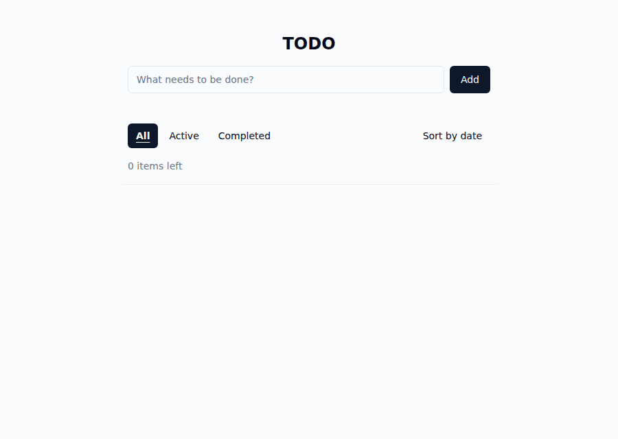
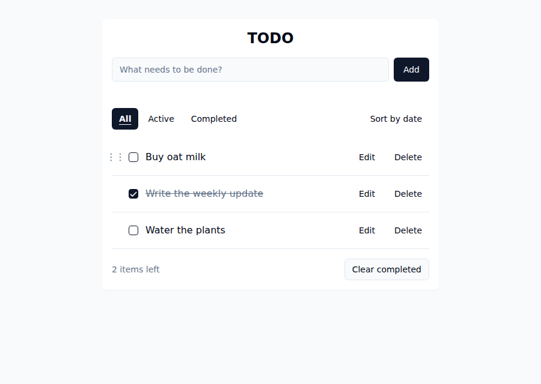
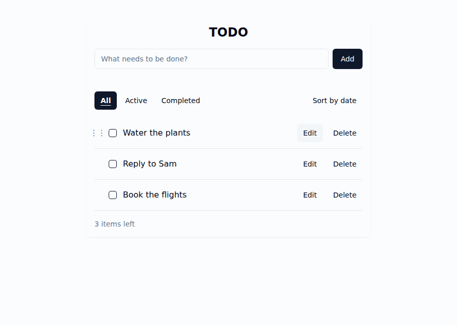
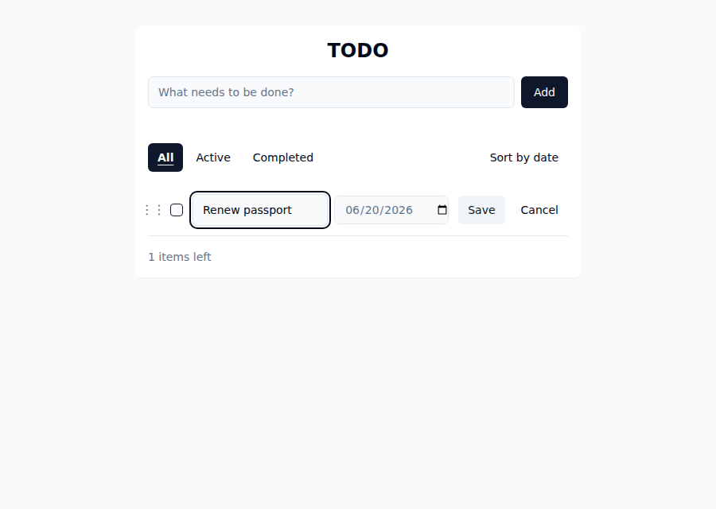
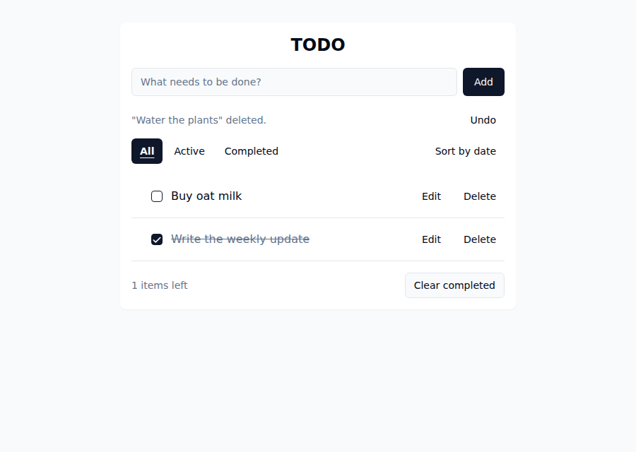
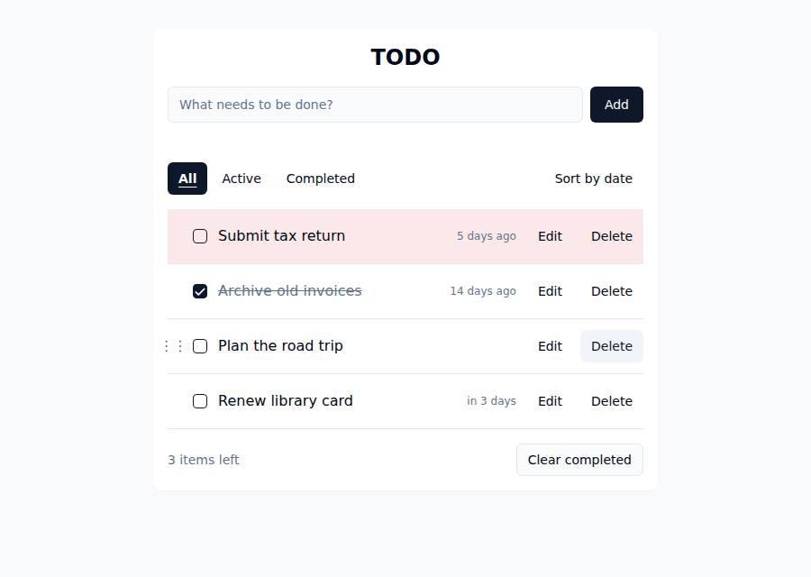
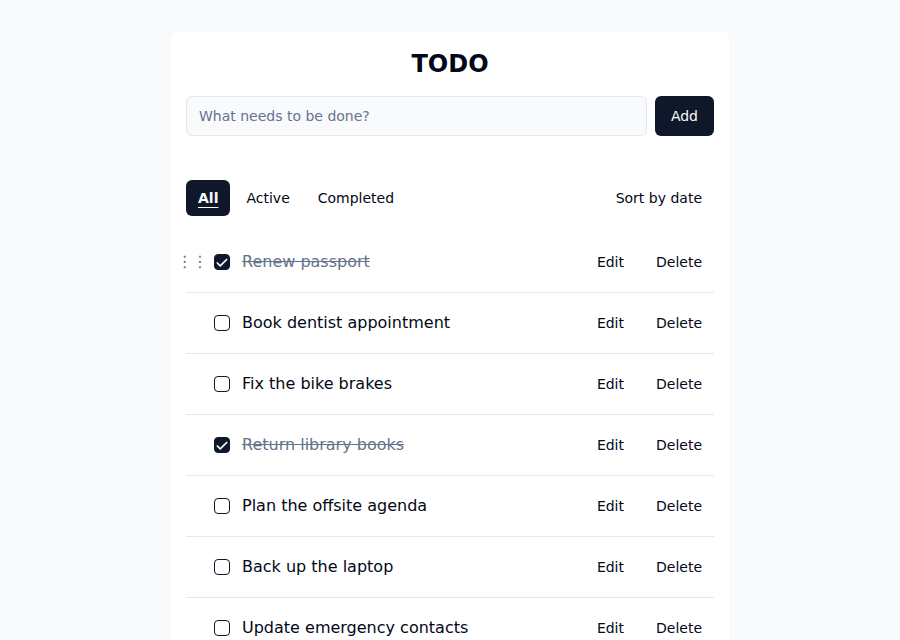

# Managing todos

The core loop — adding todos and completing one:

## Add

Type into **“What needs to be done?”** and press **Enter** or click **Add**. Empty or
whitespace-only text is ignored (the field clears, nothing is added).

## Complete / un-complete

Click an item's **checkbox** to toggle it. Completed items show struck-through, muted
text and stop counting toward **“N items left”** (the counter counts active items only).

## Reorder

Give your list a priority order by moving items up or down. Each row has a **drag
handle** in the left gutter — a 6-dot grip that appears when you hover the row or focus
any of its controls. Grab it and drag the item to a new spot; a line shows where it will
land, and the row you left keeps a dashed placeholder until you drop.

- **Keyboard.** Tab to the handle (it is the first control in each row) and press **↑**
  or **↓** to move the item one position at a time. Focus stays on the item as it moves,
  and each move is announced — *"&lt;item&gt; moved to position 2 of 3."* At the top or
  bottom the key does nothing and says so.
- **Where it works.** Reordering applies only in the **All** view with the default
  (manual) order. Apply an **Active/Completed** filter or turn on **Sort by date** and the
  handle dims and stops responding — those views show a subset or a derived order, so
  "move to any position" has no stored meaning there. Return to **All** with sort off and
  your manual order is exactly as you left it.
- **Persistence.** The new order saves with the same whole-list save as every other
  change, so it survives a reload.

## Edit

Start an edit by **double-clicking the item's text** or clicking its **Edit** button.
The text becomes an input field alongside a due-date field, and the row's **Edit**/
**Delete** buttons are replaced by **Save** and **Cancel** — the edit is only ever
committed or discarded by an explicit action, never just by clicking or tabbing
elsewhere.

- Click **Save** (or press **Enter**) to commit both the text and the due date together.
- Click **Cancel** (or press **Escape**) to discard both — any text or date change you
  made in this edit session is dropped, and the item keeps its original text and date.
- Saving with empty (or only whitespace) text leaves the item's text unchanged; a date
  change you also made is still saved.

## Delete

Click the item's **Delete** button. This takes effect immediately — there is no
confirmation step, but you can **undo** it (see below).

## Clear completed

The **Clear completed** button below the list removes every completed item at once — also
undoable. It only appears when the **currently filtered view** holds at least one completed
item: on the **Active** filter (which shows no completed items) it is hidden, and on **All** or
**Completed** it appears only once something is actually completed.

## Undo a delete or clear-completed

For **5 seconds** after you delete a single item or run **Clear completed**, an **Undo**
control appears next to the notice line. Click it to restore what you removed — text,
completed state, and roughly its original position — as one action.

The window is short and single-use:

- It covers only your **most recent** delete or clear-completed (a new one replaces the
  pending undo).
- Any other change you make — adding, editing, toggling, deleting again — **dismisses**
  the pending undo immediately (a blank add or whitespace-only edit does not).
- Undo restores into the **current** shared list, so it won't clobber an edit someone
  else made to a surviving item in the meantime.

Undo is for the here-and-now; it is not a history or a trash bin, and it does not survive
a page reload.

## Due dates

Click **Edit** (or double-click the text) to open a row for editing — the **date field**
appears there, alongside the text. Pick a day to give the item a due date; clear the
field to return it to "no date." An ordinary (non-editing) row shows no date field at
all, so items with no date waste no space on one.

- **Time-left label.** Outside edit mode, a dated item shows a short relative label
  instead of the raw date — "in 3 days," "due tomorrow," "due today." An undated item
  shows no label.
- **Overdue: row highlight, not a badge.** An active item whose date is **before today**
  gets its whole row highlighted, and its label switches to the past tense — "yesterday,"
  "5 days ago" — instead of the future-tense phrasing. That past-tense wording is the
  non-color-alone signal; there's no literal "Overdue" word. An item due *today* or in the
  future is not overdue, and **completing** an item removes the highlight regardless of
  its date (its label still shows, just without the highlight).
- **Sort by date.** The **Sort by date** toggle orders the list soonest-due-first (so
  overdue items surface first), with undated items last. It only changes the view — it
  never modifies or reorders the stored list — and toggles back to the default order.

## Filters

**All / Active / Completed** above the list switch which items are shown, sitting in the same
row as the **Sort by date** toggle. The selected filter is highlighted (filled, bold,
underlined). Filtering only changes the view — it never modifies the list.

## Limits

The app enforces two limits, and tells you when you hit them (in the notice line under
the add field):

- **Item text: 32 characters.** Typing or editing past the limit is refused with
  *“Item text is limited to 32 characters.”* If an item somehow already exceeds the
  limit, you can still edit it shorter — only growth is blocked.
- **List size: 10 items.** Adding to a full list is refused with *“The list is full
  (10 items max). Delete an item to add a new one.”* Your typed text is kept, so
  nothing is lost. Existing items can still be edited, completed, or deleted at the
  cap — only adding is blocked.

Next: [Sync & storage](sync-and-storage.md).
